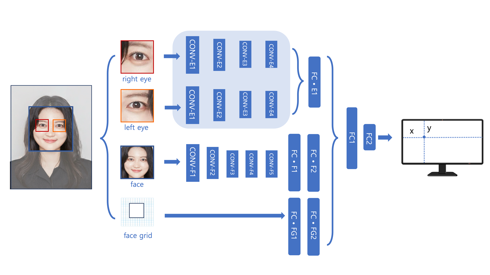

# EyeTracking Model (Fine-tuned from GazeCapture)

본 프로젝트는 **MIT CSAIL의 [GazeCapture](https://github.com/CSAILVision/GazeCapture)** 데이터를 기반으로,  
공식 공개 모델(PyTorch 구현)을 가져와 **파인튜닝(Fine-tuning)** 한 **시선 추적(Eye Tracking)** 모델입니다.  

추가적으로, 데이터 수집 및 서버 전송 파이프라인을 구현하여 **실험 환경(WebSocket, AWS EC2 연동)**에서도 활용할 수 있도록 개발되었습니다.  

---

## 📂 프로젝트 구조

```text
├── train_itracker.py              # 학습 스크립트 (fine-tuning 코드 포함)
├── test_itracker.py               # 모델 테스트 스크립트
├── ITrackerModel.py               # 시선 추적 모델 정의 (CNN 기반, PyTorch)
├── ITrackerData.py                # 데이터셋 로더
├── detector.py                    # 얼굴/눈 검출기 (dlib 기반)
├── utils.py                       # 유틸 함수
├── event.py                       # 이벤트 처리 코드
├── gaze_button.html               # 웹 인터페이스 (버튼 클릭 예제)
├── gaze_ws_server.py              # WebSocket 기반 서버
├── gaze_send_EC2.py               # AWS EC2 서버 전송 코드
├── dataset_for_test.py            # 테스트용 데이터셋 스크립트
├── test_dataset_new.py            # 신규 데이터셋 테스트
├── shape_predictor_68_face_landmarks.dat   # dlib 얼굴 랜드마크 모델
├── 1000_0005_128_nonorm.pth       # 파인튜닝된 모델 파라미터
└── 추가데이터_연구실/               # 추가 수집된 데이터
```
---

## 모델 구조

<p align="center">
  
</p>

- **Right Eye / Left Eye** → 각각 CNN 피쳐 추출  
- **Face 이미지** → CNN 피쳐 추출  
- **Face Grid** → Fully Connected Layer  
- 최종적으로 Concatenate → FC1 → FC2 → (x, y) gaze 좌표 출력  

---

## 데이터 수집 및 서버 전송 파이프라인

- `detector.py` : 얼굴 및 눈 검출 → ROI 추출  
- `event.py` : 실험 이벤트 기록  
- `gaze_ws_server.py` : WebSocket 서버  
- `gaze_send_EC2.py` : AWS EC2 서버로 gaze 데이터 전송  
---


