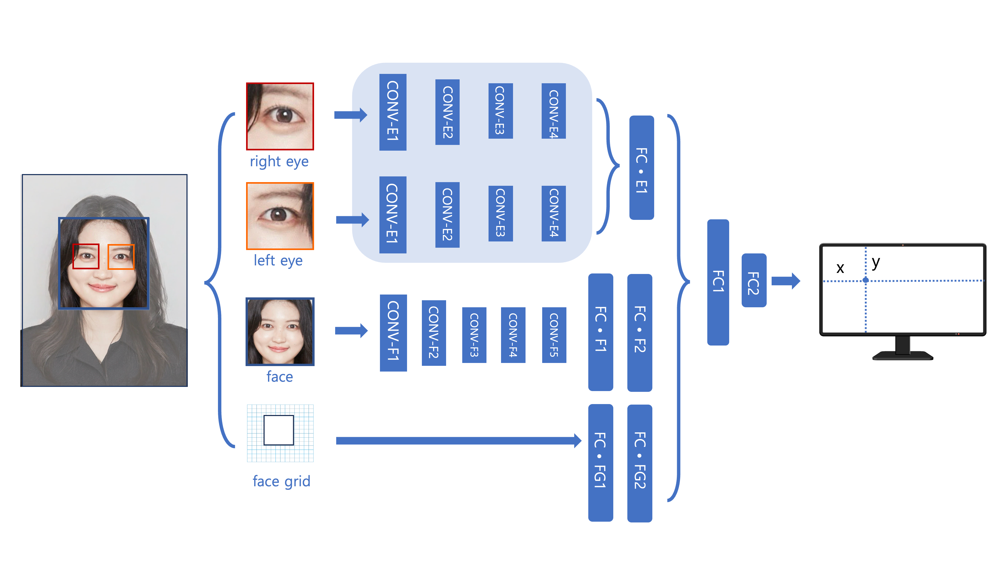

# EyeTracking Model (Fine-tuned from GazeCapture)

본 프로젝트는 **MIT CSAIL의 [GazeCapture](https://github.com/CSAILVision/GazeCapture)** 데이터를 기반으로,  
공식 공개 모델(PyTorch 구현)을 가져와 **파인튜닝(Fine-tuning)** 한 **시선 추적(Eye Tracking)** 모델입니다.  

추가적으로, 데이터 수집 및 서버 전송 파이프라인을 구현하여 프로젝트 환경(WebSocket, AWS EC2 연동)에서도 활용할 수 있도록 개발했습니다.  

---

## 📂 프로젝트 구조

```text
├── train_itracker.py              # 학습 스크립트 (fine-tuning 코드 포함)
├── test_itracker.py               # 모델 테스트 스크립트
├── ITrackerModel.py               # 시선 추적 모델 정의 (CNN 기반, PyTorch)
├── ITrackerData.py                # 데이터셋 로더
├── detector.py                    # 얼굴/눈 검출기 (dlib 기반)
├── utils.py                       # 유틸 함수
├── event.py                       # 이벤트 처리 코드
├── gaze_button.html               # 웹 인터페이스 (버튼 클릭 예제)
├── gaze_ws_server.py              # WebSocket 기반 서버
├── gaze_send_EC2.py               # AWS EC2 서버 전송 코드
├── dataset_for_test.py            # 테스트용 데이터셋 스크립트
├── test_dataset_new.py            # 신규 데이터셋 테스트
├── shape_predictor_68_face_landmarks.dat   # dlib 얼굴 랜드마크 모델
├── 1000_0005_128_nonorm.pth       # 파인튜닝된 모델 파라미터
└── 추가데이터_연구실/               # 추가 수집된 데이터
```
---

## 모델 구조

<p align="center">
  
</p>

- **Right Eye / Left Eye** → 각각 CNN 피쳐 추출  
- **Face 이미지** → CNN 피쳐 추출  
- **Face Grid** → Fully Connected Layer  
- 최종적으로 Concatenate → FC1 → FC2 → (x, y) gaze 좌표 출력  

---

## 데이터 수집 및 서버 전송 파이프라인

- `detector.py` : 얼굴 및 눈 검출 → ROI 추출  
- `event.py` : 실험 이벤트 기록  
- `gaze_ws_server.py` : WebSocket 서버  
- `gaze_send_EC2.py` : AWS EC2 서버로 gaze 데이터 전송  
---


# Eye Tracking with iTracker (GazeCapture)

웹캠 기반 실시간 시선 추적 시스템. MIT CSAIL의 [GazeCapture](http://gazecapture.csail.mit.edu/) 논문에서 제안된 iTracker 모델을 활용하여 사용자의 시선 좌표를 예측하고, 이를 기반으로 시선 클릭(Dwell Click) 인터랙션을 구현한다.

## 주요 기능

- **실시간 시선 추적**: 웹캠으로 얼굴/눈 영역을 검출하고, iTracker 모델로 화면 내 시선 좌표(x, y)를 예측
- **시선 클릭 (Dwell Click)**: 시선이 버튼 위에 일정 시간 머무르면 클릭으로 인식 (OpenCV 기반 / 웹 브라우저 기반)
- **WebSocket 연동**: 시선 좌표를 WebSocket으로 전송하여 원격 서버(EC2) 또는 웹 프론트엔드와 연동
- **학습 데이터 수집**: 화면의 격자 포인트를 응시하면서 얼굴/눈 이미지 + face grid를 자동 수집
- **모델 학습 및 평가**: 수집된 데이터로 iTracker 모델을 fine-tuning하고 정확도를 측정

## 폴더 구조

```
EyeTracking/
├── ITrackerModel.py        # iTracker 모델 정의 (CNN 기반)
├── ITrackerData.py         # GazeCapture 데이터셋 로더 (원본 형식)
├── detector.py             # dlib 기반 얼굴/눈 영역 검출
├── utils.py                # face grid 생성, 이미지 저장 등 유틸리티
├── train_itracker.py       # 모델 학습 스크립트
├── test_itracker.py        # 실시간 시선 추적 테스트 (OpenCV 시각화)
├── test_dataset_new.py     # 데이터셋 기반 정량 평가
├── event.py                # 시선 클릭(Dwell Click) 데모
├── main_data_4s.py         # 학습 데이터 수집 (30x15 격자)
├── dataset_for_test.py     # 테스트 데이터 수집 (5x5 격자)
├── gaze_ws_server.py       # WebSocket 시선 좌표 서버 (로컬)
├── gaze_send_EC2.py        # WebSocket 시선 좌표 클라이언트 (EC2 전송)
├── gaze_button.html        # 웹 브라우저 시선 클릭 UI
└── LICENSE.md              # GazeCapture 연구 라이선스
```

## 실행 환경

- Python 3.8+
- macOS / Linux (웹캠 접근 필요)
- CUDA (선택, GPU 가속 시)

## 의존성 설치

```bash
pip install torch torchvision numpy opencv-python dlib Pillow scipy websockets pandas
```

> `dlib` 설치 시 CMake가 필요할 수 있습니다: `brew install cmake` (macOS)

## 필요한 외부 파일

아래 파일들은 용량 문제로 Git에 포함되어 있지 않습니다. 별도로 다운로드하여 프로젝트 루트에 배치하세요.

| 파일 | 설명 | 다운로드 |
|------|------|----------|
| `shape_predictor_68_face_landmarks.dat` | dlib 얼굴 랜드마크 모델 (95MB) | [dlib.net](http://dlib.net/files/shape_predictor_68_face_landmarks.dat.bz2) |
| `1000_0005_128_nonorm.pth` | 학습된 iTracker 가중치 (24MB) | 팀 내부 공유 |

## 실행 방법

### 1. 실시간 시선 추적 테스트

```bash
python test_itracker.py
```

웹캠에서 얼굴을 인식하면 화면에 시선 좌표가 초록색 점으로 표시됩니다. ESC로 종료.

### 2. 시선 클릭 데모

```bash
python event.py
```

화면의 버튼 위에 시선을 2초간 유지하면 클릭으로 인식됩니다.

### 3. 학습 데이터 수집

```bash
python main_data_4s.py
```

화면에 빨간 점이 표시되면 해당 점을 응시한 상태에서 스페이스바를 누르세요. 4초간 캡처 후 다음 점으로 이동합니다.

### 4. 모델 학습

```bash
python train_itracker.py
```

`dataset/metadata.csv` 경로에 수집된 데이터가 필요합니다.

### 5. WebSocket 연동 (웹 브라우저)

```bash
# 터미널 1: 시선 좌표 서버 시작
python gaze_ws_server.py

# 터미널 2: 브라우저에서 gaze_button.html 열기
```

## 참고 논문

```
Eye Tracking for Everyone
K. Krafka*, A. Khosla*, P. Kellnhofer, H. Kannan, S. Bhandarkar, W. Matusik, A. Torralba
IEEE Conference on Computer Vision and Pattern Recognition (CVPR), 2016
```

## Developer

- **dolmaroyujinpark** - [GitHub](https://github.com/dolmaroyujinpark)

## License

이 프로젝트는 GazeCapture Research License를 따릅니다. 자세한 내용은 [LICENSE.md](LICENSE.md)를 참조하세요. 연구 목적으로만 사용 가능합니다.
